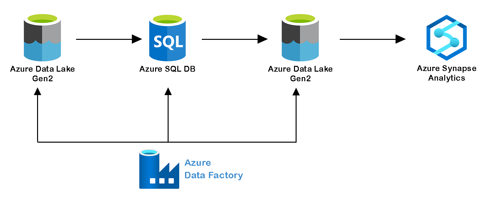
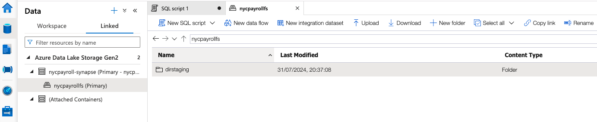
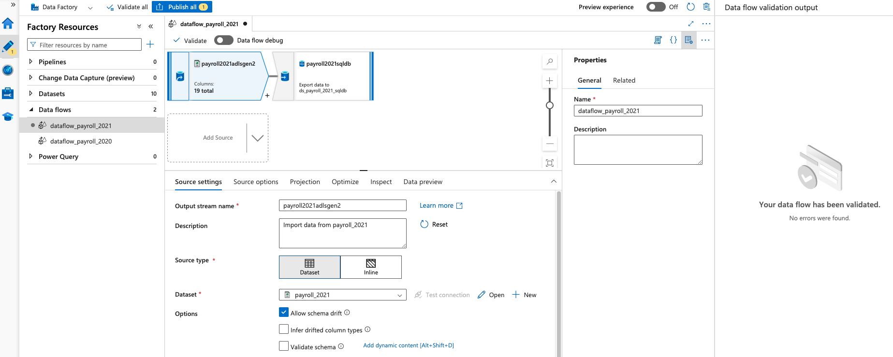
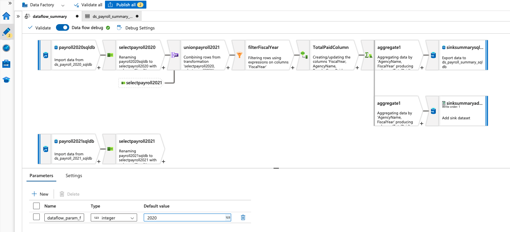
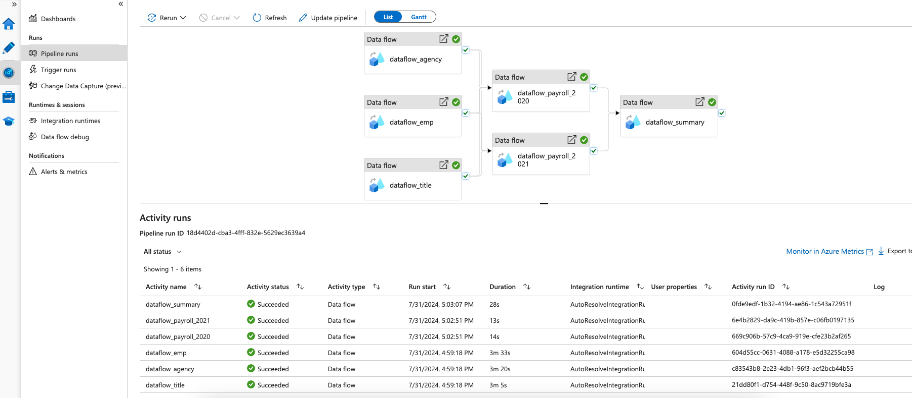
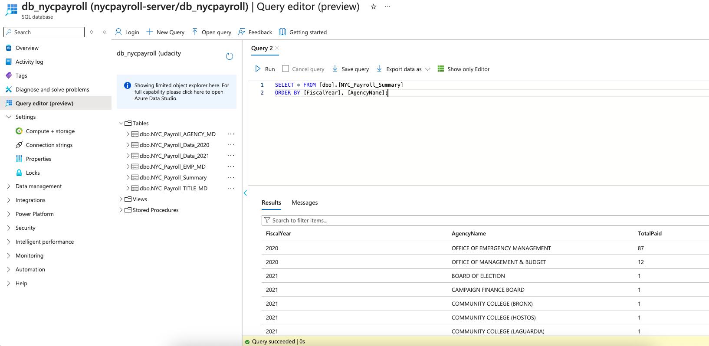
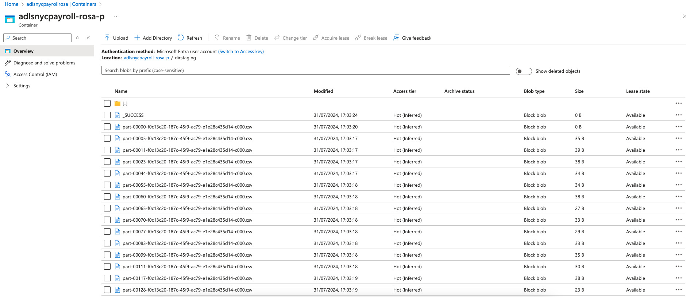
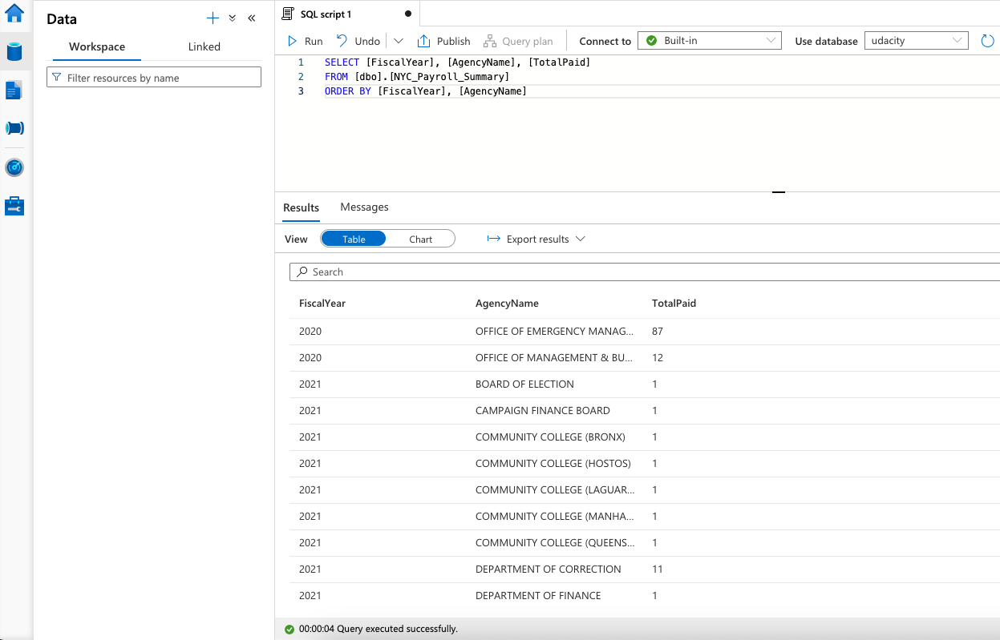

# New York City Payroll Data Analysis

## Overview

The City of New York aims to build a Data Analytics platform on Azure Synapse Analytics to achieve two key goals:

- Analyze the allocation of the City's financial resources, particularly focusing on the portion of the budget allocated to overtime.
- Provide public access to data that transparently shows how the City’s budget is spent on salaries and overtime pay for all municipal employees.

As a Data Engineer, our role is to develop high-quality data pipelines that are dynamic, automated, and easily monitored for optimal performance. The project team also includes the city’s quality assurance specialists, who will test the pipelines to identify errors and enhance overall data quality.

## Project Goals

- Create high-quality data pipelines that are dynamic, can be automated, and monitored for efficient operation.

## System Architecture

## Data set

The source data is stored in Azure Data Lake and needs to be processed into a NYC data warehouse. The datasets include CSV files containing Employee master data and monthly payroll data submitted by various City agencies.

## Project Workflow

1. <b>Create Azure resources:</b>

- Azure Storage Account
- Azure SQL Database
- Azure Data Factory
- Azure Synapse Analytics

2. <b>In Azure Synapse Analytics</b>

- Create a new Azure Data Lake Gen2 and file system for Synapse Analytics when you are creating the Synapse Analytics workspace in the Azure portal. (This Azure Data Lake Gen2 is different with the Azure Storage Account containing all the source CSV files)
- After creating the Synapse workspace, create dirstaging folder in the linked data lake storage account.

- Create summary data external table in Synapse Analytics workspace   
`synapse_NYC_Payroll_Summary_table.sql`

3. <b>In SQL DB</b>

Create master data tables and payroll transaction tables in SQL DB

- `NYC_Payroll_AGENCY_MD_table.sql`
- `NYC_Payroll_Data_2020_table.sql`
- `NYC_Payroll_Data_2021_table.sql`
- `NYC_Payroll_EMP_MD_table.sql`
- `NYC_Payroll_TITLE_MD_table.sql`
- `sqldb_NYC_Payroll_Summary_table.sql`

4. <b>In Azure Data Factory</b>

- Add data flows to load data for each file in Azure DataLake to the corresponding SQL DB tables.

- Data Aggregation and Parameterization
  In this step, we'll extract the 2021 year data and historical data, merge, aggregate and store it in DataLake staging area which will be used by Synapse Analytics external table. The aggregation will be on Agency Name, Fiscal Year and TotalPaid.

5. <b>Pipeline Creation</b>
   We will create a pipeline to load data from Azure DataLake Gen2 storage in SQL db for individual datasets, perform aggregations and store the summary results back into SQL db destination table and datalake staging storage directory which will be consumed by Synapse Analytics via CETAS.

7. <b>Verify Pipeline</b>

- Query data in SQL DB summary table (destination table). This is one of the sinks defined in the pipeline.

- Check the dirstaging directory in Datalake if files got created. This is one of the sinks defined in the pipeline

- Query data in Synapse external table that points to the dirstaging directory in Datalake.

