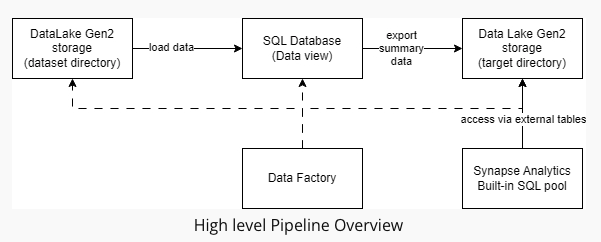

## Overview

The City of New York would like to develop a Data Analytics platform on Azure Synapse Analytics to accomplish two primary objectives:

- Analyze how the City's financial resources are allocated and how much of the City's budget is being devoted to overtime.
- Make the data available to the interested public to show how the City’s budget is being spent on salary and overtime pay for all municipal employees.

The source data resides in Azure Data Lake and needs to be processed in a NYC data warehouse. The source datasets consist of CSV files with Employee master data and monthly payroll data entered by various City agencies.

## Project Goals

- Create high-quality data pipelines that are dynamic, can be automated, and monitored for efficient operation.

## Steps

1. Create Azure resources:

- Azure Storage Account
- Azure SQL Database
- Azure Data Factory

2. In Azure Synapse Analytics

- Create a new Azure Data Lake Gen2 and file system for Synapse Analytics when you are creating the Synapse Analytics workspace in the Azure portal. (This Azure Data Lake Gen2 is different with the Azure Storage Account containing all the source CSV files)
- After creating the Synapse workspace, create dirstaging folder in the linked data lake storage account.

- Create summary data external table in Synapse Analytics workspace

3. In SQL DB

- Create master data tables and payroll transaction tables in SQL DB

4. In Azure Data Factory

- Create Linked Service for Azure Date Lake
- Create a Linked Service to SQL Database that has the current (2021) data
- Create the datasets for nycpayroll_2021.csv, EmpMaster.csv, TitleMaster.csv, AgencyMaster.csv files on Azure Data Lake Gen2
- Create the datasets for all the data tables in SQL DB
- Add data flows to load data for each file in Azure DataLake to the corresponding SQL DB tables.
- Data Aggregation and Parameterization
  In this step, you'll extract the 2021 year data and historical data, merge, aggregate and store it in DataLake staging area which will be used by Synapse Analytics external table. The aggregation will be on Agency Name, Fiscal Year and TotalPaid.

* Create new data flow and name it Dataflow Summary
* Add source as payroll 2020 data from SQL DB
* Add another source as payroll 2021 data from SQL DB
* Create a new Union activity and select both payroll datasets as the source
* Make sure to do any source to target mappings if required. This can be done by adding a Select activity before Union
* After Union, add a Filter activity, go to Expression builder
  - Create a parameter named- dataflow_param_fiscalyear and give value 2020 or 2021
  - Include expression to be used for filtering: toInteger(FiscalYear) >= $dataflow_param_fiscalyear
* Now, choose Derived Column after filter
  - Name the column: TotalPaid
  - Add following expression: RegularGrossPaid + TotalOTPaid+TotalOtherPay
* Add an Aggregate activity to the data flow next to the TotalPaid activity
  - Under Group by, select AgencyName and FiscalYear
  - Set the expression to sum(TotalPaid)
* Add a Sink activity after the Aggregate
  - Select the sink as summary table created in SQL db
  - In Settings, tick Truncate table
* Add another Sink activity, this will create two sinks after Aggregate
  Create a linked service to the data lake that you created the 'dirstaging' folder. - Add a Sink activity: - Choose Inline as the sink type. - Choose DelimitedText as inline dataset type. - Choose the linked service. - In Settings, browse the dirstaging folder. - Tick Clear the folder (to remove existing files from the folder before writing new data).

5. Pipeline Creation
   We will create a pipeline to load data from Azure DataLake Gen2 storage in SQL db for individual datasets, perform aggregations and store the summary results back into SQL db destination table and datalake staging storage directory which will be consumed by Synapse Analytics via CETAS.

- Create a new pipeline
- Include dataflows for Agency, Employee and Title to be parallel
- Add dataflows for payroll 2020 and payroll 2021. These should run only after the initial 3 dataflows have completed
- After payroll 2020 and payroll 2021 dataflows have completed, dataflow for aggregation should be started.

6. Trigger and Monitor Pipeline

- Select Add trigger option from pipeline view in the toolbar
- Choose trigger now to initiate pipeline run
- You can go to monitor tab and check the Pipeline Runs
- Each dataflow will have an entry in Activity runs list

7. Verify Pipeline run artifacts

- Query data in SQL DB summary table (destination table). This is one of the sinks defined in the pipeline.
- Check the dirstaging directory in Datalake if files got created. This is one of the sinks defined in the pipeline
- Query data in Synapse external table that points to the dirstaging directory in Datalake.

1. Use Azure Data Factory to create Data views in Azure SQL DB from the source data files in DataLake Gen2.
2. Build our dataflows and pipelines to create payroll aggregated data that will be exported to a target directory in DataLake Gen2 storage over which Synapse Analytics external table is built.

